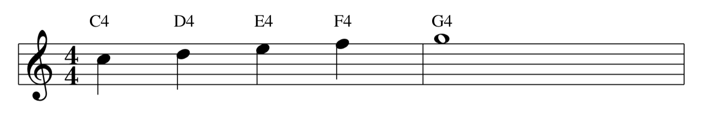
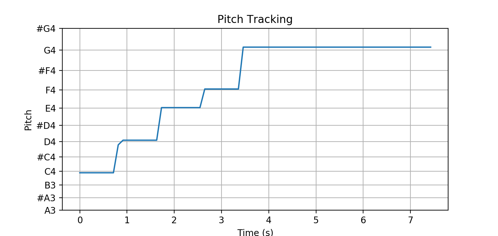
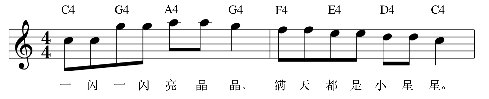
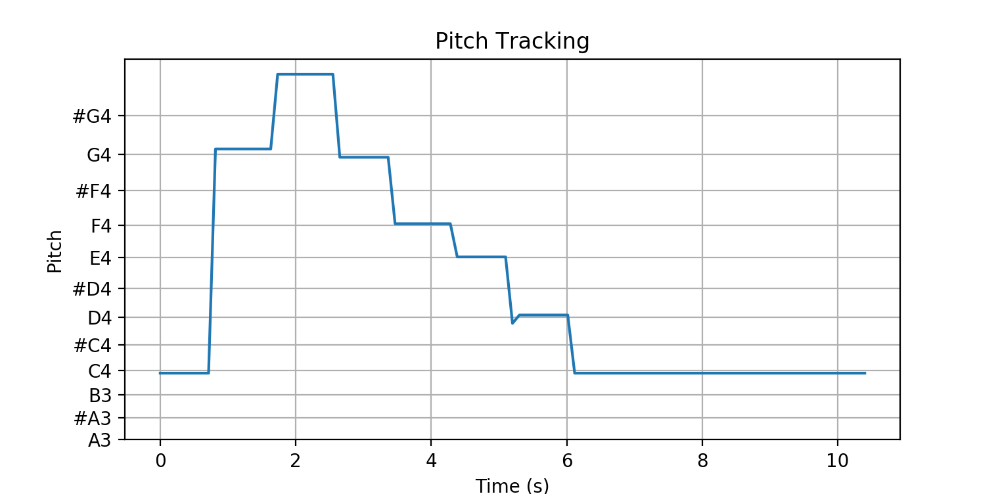

# <div align="center"></div>

A digital signal processing experiment on pitch tracking.

## Usage
```python
>>> import pitch
# To read and perform pitch tracking
>>> audio = pitch.read('sample.mp3')
>>> track_data = pitch.track(audio)
# To visualize
>>> track_data.visualize()
```

## Sample




